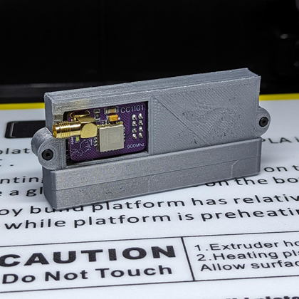
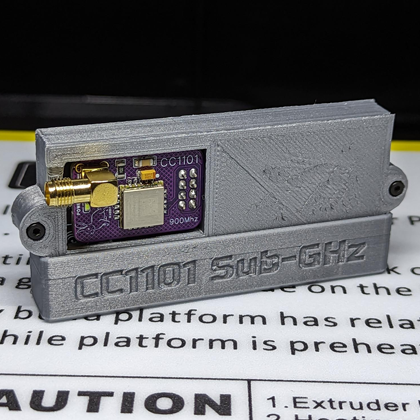
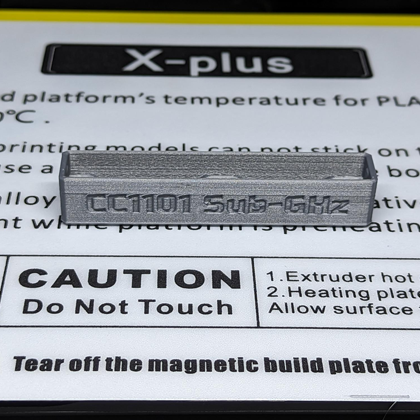
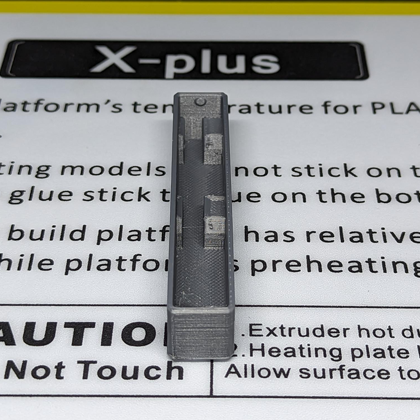

  
  <h2 align="center">Flipper Zero - CC1101 Board by TehRabbitt - Case Pin Boot Cover</h2>

### Description

This boot cover is made to fit my Flipper Zero - CC1101 Board by TehRabbitt case found at the following locations:

- https://www.thingiverse.com/thing:6122121

- https://github.com/CodyTolene/3D-Printing/tree/main/Flipper%20Zero%20-%20CC1101%20Board%20by%20TehRabbitt%20-%20Case

My print settings:

- Hatchbox PLA
- 0.2mm layer height
- 0.4mm nozzle (line width)
- Enable retraction
- Wall count 3 (+ print thin walls enabled)
- Top/bottom layers: 4
- Infill density: 20%
- Infill pattern: Cubic
- Print temp 200 C
- Bed temp 60 C
- No supports needed

Enjoy!

[ <a href="#top">Top</a> | <a href="../README.md">Index</a> ]

### File Downloads

- Boot Pin Cover, no labels: [3mf][download-3mf] | [stl][download-stl] | [view][view-stl]

- Boot Pin Cover w/ "CC1101 Sub-GHz" label: [3mf][download-cc1101-label-3mf] | [stl][download-cc1101-label-stl] | [view][view-cc1101-label-stl]

[ <a href="#top">Top</a> | <a href="../README.md">Index</a> ]

### License

CC-BY-NC-4.0 ([view license][link-license])

[ <a href="#top">Top</a> | <a href="../README.md">Index</a> ]

### Images

---

---

---

---

[ <a href="#top">Top</a> | <a href="../README.md">Index</a> ]

<!-- LINKS -->

[link-flipper-zero]: https://flipperzero.one/
[link-license]: https://github.com/CodyTolene/3D-Printing/blob/main/Flipper%20Zero%20-%20CC1101%20Board%20by%20TehRabbitt%20-%20Case%20Pin%20Boot%20Cover/LICENSE.md
[link-tindie-cc1101]: https://www.tindie.com/products/tehrabbitt/flipper-zero-cc1101-expansion-board-by-tehrabbitt/

<!-- DOWNLOADS: SET 1 -->

[download-3mf]: https://github.com/CodyTolene/3D-Printing/raw/main/Flipper%20Zero%20-%20CC1101%20Board%20by%20TehRabbitt%20-%20Case%20Pin%20Boot%20Cover/Flipper_Zero_CC1101_Case_Pin_Boot_Cover.3mf
[download-stl]: https://github.com/CodyTolene/3D-Printing/raw/main/Flipper%20Zero%20-%20CC1101%20Board%20by%20TehRabbitt%20-%20Case%20Pin%20Boot%20Cover/Flipper_Zero_CC1101_Case_Pin_Boot_Cover.stl
[view-stl]: https://github.com/CodyTolene/3D-Printing/blob/main/Flipper%20Zero%20-%20CC1101%20Board%20by%20TehRabbitt%20-%20Case%20Pin%20Boot%20Cover/Flipper_Zero_CC1101_Case_Pin_Boot_Cover.stl

<!-- DOWNLOADS: SET 2 -->

[download-cc1101-label-3mf]: https://github.com/CodyTolene/3D-Printing/raw/main/Flipper%20Zero%20-%20CC1101%20Board%20by%20TehRabbitt%20-%20Case%20Pin%20Boot%20Cover/Flipper_Zero_CC1101_Case_Pin_Boot_Cover_Label.3mf
[download-cc1101-label-stl]: https://github.com/CodyTolene/3D-Printing/raw/main/Flipper%20Zero%20-%20CC1101%20Board%20by%20TehRabbitt%20-%20Case%20Pin%20Boot%20Cover/Flipper_Zero_CC1101_Case_Pin_Boot_Cover_Label.stl
[view-cc1101-label-stl]: https://github.com/CodyTolene/3D-Printing/blob/main/Flipper%20Zero%20-%20CC1101%20Board%20by%20TehRabbitt%20-%20Case%20Pin%20Boot%20Cover/Flipper_Zero_CC1101_Case_Pin_Boot_Cover_Label.stl
