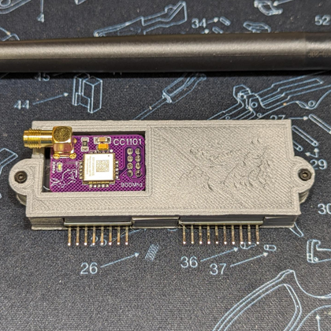
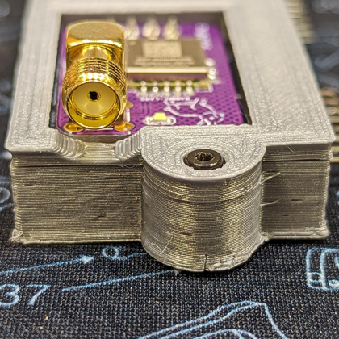

  
  <h2 align="center">Flipper Zero - CC1101 Board by TehRabbitt - Case</h2>

### Description

Introducting a quick and practical case I put together to fit the CC1101 expansion board made by TehRabbitt. The board can be purchased on Tindie [here][link-tindie-cc1101]. The board is designed to be used with the Flipper Zero, which can be found [here][link-flipper-zero].

To assemble the case, you'll need two M2x10mm screws and two M2 nuts. Don't worry about sourcing these components; I've made it easier for you by providing a direct Amazon link where you can find the same M2 screw set I recommend (https://amzn.to/3NTcd8R). By purchasing through this link, you also show your support for my work - thank you!

This design also has a pin protector boot cover that can be found in the following locations:

- https://www.thingiverse.com/thing:6123576

- https://github.com/CodyTolene/3D-Printing/tree/main/Flipper%20Zero%20-%20CC1101%20Board%20by%20TehRabbitt%20-%20Case%20Pin%20Boot%20Cover

My print settings:

- Hatchbox PLA
- 0.2mm layer height
- 0.4mm nozzle (line width)
- Enable retraction
- Wall count 3 (+ print thin walls enabled)
- Top/bottom layers: 4
- Infill density: 20%
- Infill pattern: Cubic
- Print temp 200 C
- Bed temp 60 C
- No supports needed

Enjoy!

[ <a href="#top">Top</a> | <a href="../README.md">Index</a> ]

### File Downloads

- Flipper Zero - CC1101 Board by TehRabbitt - Case (top + bottom): [3mf][download-full-3mf] | [stl][download-full-stl] | [view][view-full-stl]

- Flipper Zero - CC1101 Board by TehRabbitt - Case (top only): [3mf][download-top-3mf] | [stl][download-top-stl] | [view][view-top-stl]

- Flipper Zero - CC1101 Board by TehRabbitt - Case (bottom only): [3mf][download-bottom-3mf] | [stl][download-bottom-stl] | [view][view-bottom-stl]

[ <a href="#top">Top</a> | <a href="../README.md">Index</a> ]

### License

CC-BY-NC-4.0 ([view license][link-license])

[ <a href="#top">Top</a> | <a href="../README.md">Index</a> ]

### Images

---

---

---

---

---

---

---

[ <a href="#top">Top</a> | <a href="../README.md">Index</a> ]

<!-- LINKS -->

[link-flipper-zero]: https://flipperzero.one/
[link-license]: https://github.com/CodyTolene/3D-Printing/blob/main/Flipper%20Zero%20-%20CC1101%20Board%20by%20TehRabbitt%20-%20Case/LICENSE.md
[link-tindie-cc1101]: https://www.tindie.com/products/tehrabbitt/flipper-zero-cc1101-expansion-board-by-tehrabbitt/

<!-- DOWNLOADS: SET 1 -->

[download-full-3mf]: https://github.com/CodyTolene/3D-Printing/raw/main/Flipper%20Zero%20-%20CC1101%20Board%20by%20TehRabbitt%20-%20Case/Flipper_Zero_CC1101_Board_Case_Full.3mf
[download-full-stl]: https://github.com/CodyTolene/3D-Printing/raw/main/Flipper%20Zero%20-%20CC1101%20Board%20by%20TehRabbitt%20-%20Case/Flipper_Zero_CC1101_Board_Case_Full.stl
[view-full-stl]: https://github.com/CodyTolene/3D-Printing/blob/main/Flipper%20Zero%20-%20CC1101%20Board%20by%20TehRabbitt%20-%20Case/Flipper_Zero_CC1101_Board_Case_Full.stl

<!-- DOWNLOADS: SET 2 -->

[download-top-3mf]: https://github.com/CodyTolene/3D-Printing/raw/main/Flipper%20Zero%20-%20CC1101%20Board%20by%20TehRabbitt%20-%20Case/Flipper_Zero_CC1101_Board_Case_Top.3mf
[download-top-stl]: https://github.com/CodyTolene/3D-Printing/raw/main/Flipper%20Zero%20-%20CC1101%20Board%20by%20TehRabbitt%20-%20Case/Flipper_Zero_CC1101_Board_Case_Top.stl
[view-top-stl]: https://github.com/CodyTolene/3D-Printing/blob/main/Flipper%20Zero%20-%20CC1101%20Board%20by%20TehRabbitt%20-%20Case/Flipper_Zero_CC1101_Board_Case_Top.stl

<!-- DOWNLOADS: SET 3 -->

[download-bottom-3mf]: https://github.com/CodyTolene/3D-Printing/raw/main/Flipper%20Zero%20-%20CC1101%20Board%20by%20TehRabbitt%20-%20Case/Flipper_Zero_CC1101_Board_Case_Bottom.3mf
[download-bottom-stl]: https://github.com/CodyTolene/3D-Printing/raw/main/Flipper%20Zero%20-%20CC1101%20Board%20by%20TehRabbitt%20-%20Case/Flipper_Zero_CC1101_Board_Case_Bottom.stl
[view-bottom-stl]: https://github.com/CodyTolene/3D-Printing/blob/main/Flipper%20Zero%20-%20CC1101%20Board%20by%20TehRabbitt%20-%20Case/Flipper_Zero_CC1101_Board_Case_Bottom.stl
