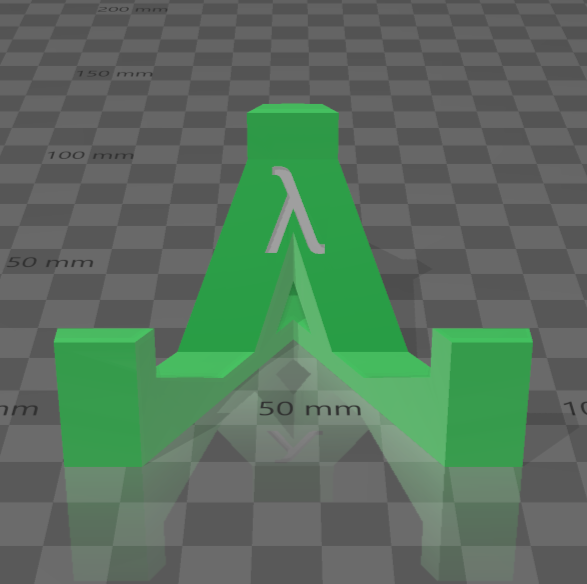
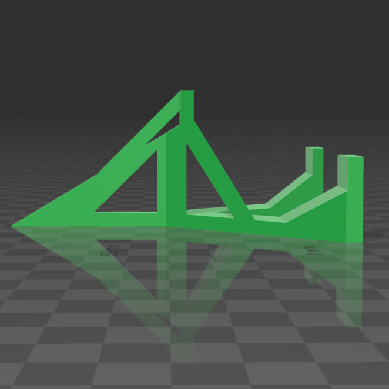

  
  <h2 align="center">Flipper Zero - Desk Stand</h2>

### Description

This modern and compact desk stand holds the Flipper Zero securely at a 30-degree angle. It features a single extended arm at the back to provide reliable support for the largest modules on the market. While other stands work well for the Flipper Zero itself, they often tip backwards and topple when using larger GPIO modules. This stand addresses that issue effectively, ensuring stability and reliability.

### Printing

All hanging angles are 45 degrees or less to ensure a clean print without supports. The print takes around 1.75 - 2 hours and uses approximately 15g of filament at 50% infill.

[ <a href="#top">Top</a> | <a href="../README.md">Index</a> ]

### File Downloads

- Flipper Zero - Desk Stand: [3mf][download-3mf] | [stl][download-stl] | [view][view-stl]

[ <a href="#top">Top</a> | <a href="../README.md">Index</a> ]

### License

CC-BY-NC-4.0 ([view license][link-license])

[ <a href="#top">Top</a> | <a href="../README.md">Index</a> ]

### Images

  

  

  

[ <a href="#top">Top</a> | <a href="../README.md">Index</a> ]

<!-- LINKS -->

[link-license]: https://github.com/CodyTolene/3D-Printing/blob/main/Flipper%20Zero%20-%20Desk%20Stand/LICENSE.md

<!-- DOWNLOADS -->

[download-3mf]: https://github.com/CodyTolene/3D-Printing/raw/main/Flipper%20Zero%20-%20Desk%20Stand/Flipper-Zero-Desk-Stand.3mf
[download-stl]: https://github.com/CodyTolene/3D-Printing/raw/main/Flipper%20Zero%20-%20Desk%20Stand/Flipper-Zero-Desk-Stand.stl
[view-stl]: https://github.com/CodyTolene/3D-Printing/blob/main/Flipper%20Zero%20-%20Desk%20Stand/Flipper-Zero-Desk-Stand.stl
