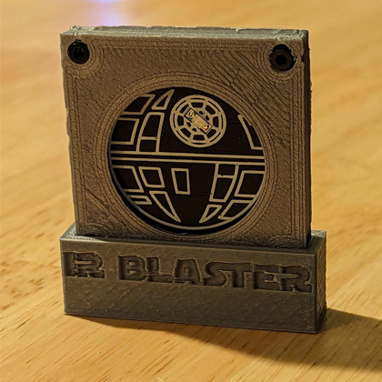
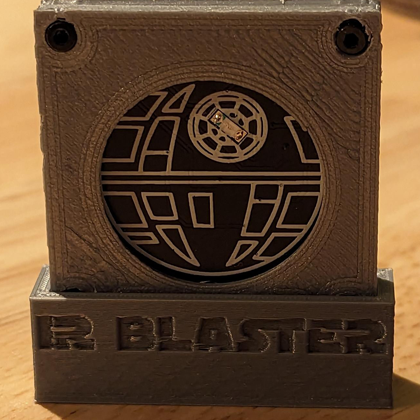
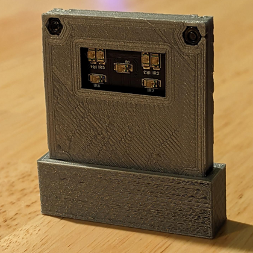
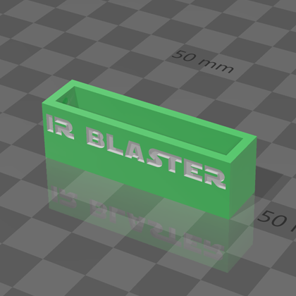

  
  <h2 align="center">Flipper Zero: Infrared (IR) Blaster Case Boot Cover</h2>

### Description

This boot cover is made to fit my Flipper Zero Infrared (IR) Blaster case found at the following locations:

- https://www.thingiverse.com/thing:6106025

- https://github.com/CodyTolene/3D-Printing/blob/main/Flipper%20Zero%20-%20Infrared%20(IR)%20Blaster%20Case

My print settings:

- Hatchbox PLA
- 0.2mm layer height
- 0.4mm nozzle (line width)
- Enable retraction
- Wall count 3 (+ print thin walls enabled)
- Top/bottom layers: 4
- Infill density: 20%
- Infill pattern: Cubic
- Print temp 200 C
- Bed temp 60 C
- No supports needed

Enjoy!

[ <a href="#top">Top</a> | <a href="../README.md">Index</a> ]

### File Downloads

- Infrared (IR) Blaster Case Boot Cover: [3mf][download-3mf] | [stl][download-stl] | [view][view-stl]

[ <a href="#top">Top</a> | <a href="../README.md">Index</a> ]

### License

CC-BY-NC-4.0 ([view license][link-license])

[ <a href="#top">Top</a> | <a href="../README.md">Index</a> ]

### Images

---

---

---

---

[ <a href="#top">Top</a> | <a href="../README.md">Index</a> ]

<!-- LINKS -->

[link-license]: https://github.com/CodyTolene/3D-Printing/blob/main/Flipper%20Zero%20-%20Infrared%20(IR)%20Blaster%20Case%20Boot%20Cover/LICENSE.md

<!-- DOWNLOADS: SET 1 -->

[download-3mf]: https://github.com/CodyTolene/3D-Printing/raw/main/Flipper%20Zero%20-%20Infrared%20(IR)%20Blaster%20Case%20Boot%20Cover/flipper-zero-infrared-ir-blaster-case-boot-cover.3mf
[download-stl]: https://github.com/CodyTolene/3D-Printing/raw/main/Flipper%20Zero%20-%20Infrared%20(IR)%20Blaster%20Case%20Boot%20Cover/flipper-zero-infrared-ir-blaster-case-boot-cover.stl
[view-stl]: https://github.com/CodyTolene/3D-Printing/blob/main/Flipper%20Zero%20-%20Infrared%20(IR)%20Blaster%20Case%20Boot%20Cover/flipper-zero-infrared-ir-blaster-case-boot-cover.stl
