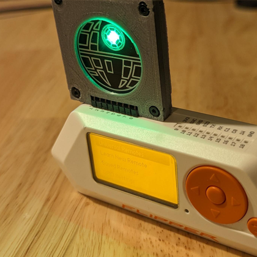
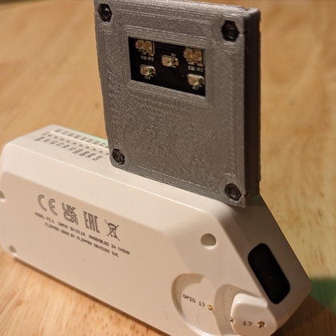
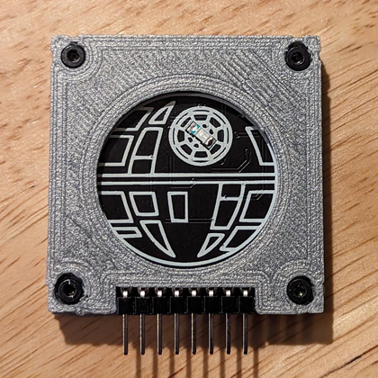
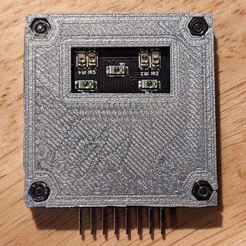
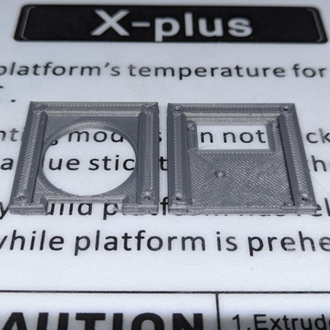
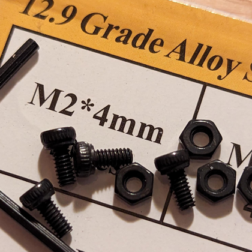
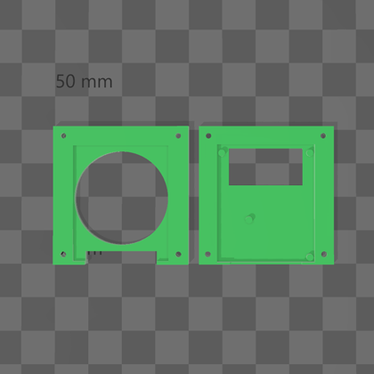

  
  <h2 align="center">Flipper Zero - Infrared (IR) Blaster Case</h2>

### Description

This is an immaculate suit of armor befitting the esteemed Flipper Zero IR Blaster, forged by the renowned Rabbit-Labs. Armed with seven luminous hyperintensity LED emitters, this magnificent apparatus harnesses the power of infrared transmissions to command the very essence of televisions, air conditioners, and other sentient devices obedient to the sway of IR signals. Fearlessly, the IR Blaster stands ready, its formidable might awaiting those who seek its mastery. Venture forth to secure your own dominion over the IR realm, for the IR Blaster can be obtained from the sacred halls of Tindie [here][link-tindie-ir-blaster].

What this case does not do:

- Make you dinner.
- Read you a poem.
- Protect you from the Rebel Alliance's Red Squadron.

This design also has a pin protector boot cover that can be found in the following locations:

- https://www.thingiverse.com/thing:6106176

- https://github.com/CodyTolene/3D-Printing/tree/main/Flipper%20Zero%20-%20Infrared%20(IR)%20Blaster%20Case%20Boot%20Cover

My print settings:

- Hatchbox PLA
- 0.16mm layer height
- Infill density: 100%
- Print temp 200 C
- Bed temp 60 C

[ <a href="#top">Top</a> | <a href="../README.md">Index</a> ]

### File Downloads

- Flipper Zero - Infrared (IR) Blaster Case: [3mf][download-3mf] | [stl][download-stl] | [view][view-stl]

[ <a href="#top">Top</a> | <a href="../README.md">Index</a> ]

### License

CC-BY-NC-4.0 ([view license][link-license])

[ <a href="#top">Top</a> | <a href="../README.md">Index</a> ]

### Images

---

---

---

---

---

---

---

[ <a href="#top">Top</a> | <a href="../README.md">Index</a> ]

<!-- LINKS -->

[link-flipper-zero]: https://flipperzero.one/
[link-license]: https://github.com/CodyTolene/3D-Printing/blob/main/Flipper%20Zero%20-%20Infrared%20(IR)%20Blaster%20Case/LICENSE.md
[link-tindie-ir-blaster]: https://www.tindie.com/products/tehrabbitt/flipper-zero-ir-blaster/

<!-- DOWNLOADS: SET 1 -->

[download-3mf]: https://github.com/CodyTolene/3D-Printing/raw/main/Flipper%20Zero%20-%20Infrared%20(IR)%20Blaster%20Case/flipper-zero-infrared-ir-blaster-case.3mf
[download-stl]: https://github.com/CodyTolene/3D-Printing/raw/main/Flipper%20Zero%20-%20Infrared%20(IR)%20Blaster%20Case/flipper-zero-infrared-ir-blaster-case.stl
[view-stl]: https://github.com/CodyTolene/3D-Printing/blob/main/Flipper%20Zero%20-%20Infrared%20(IR)%20Blaster%20Case/flipper-zero-infrared-ir-blaster-case.stl
