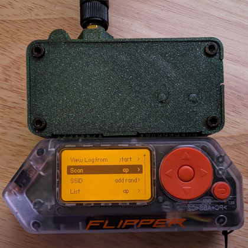
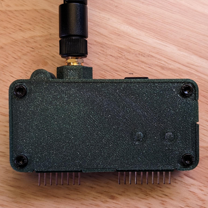
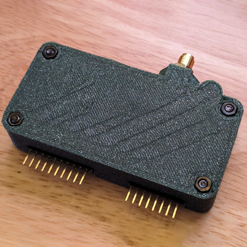
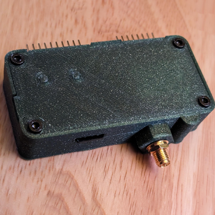
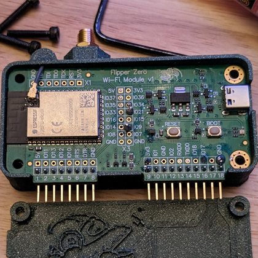
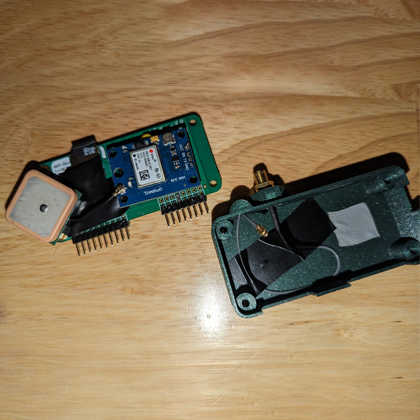
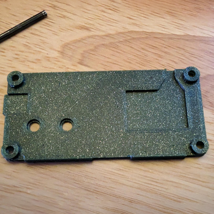
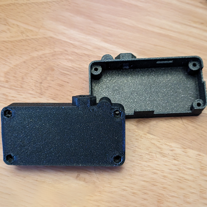
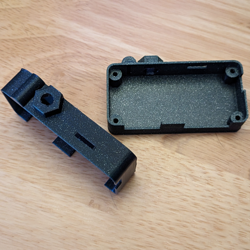
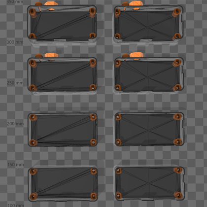

  
  <h2 align="center">Flipper Zero: Minimalist Wi-Fi Dev Board Case (GPS + SD)</h2>

### Description

A minimalistic 3D printable case for the [Flipper Zero Wi-Fi Dev Board][link-flipper-zero-wifi-devboard]. There are two variations of this case, a larger XL version and a normal size MD version. The XL version has a larger under-cavity for addons such as a GPS module. The MD version has a smaller under-cavity for minimal wiring. Both versions have antenna and/or Micro SD card slot options.

### Bottom Variations

#### XL (17.75mm thick), 11mm under-cavity, GPS/additions capable:

- **XL** > Fully loaded > Antenna mount > Micro SD card slot (by [justcallmekoko][link-tindie-justcallmekoko-sd]):

  - [3mf][download-xl-full-3mf] | [stl][download-xl-full-stl] | [view][view-xl-full-stl]

- **XL** > Antenna mount only:

  - [3mf][download-xl-antenna-only-3mf] | [stl][download-xl-antenna-only-stl] | [view][view-xl-antenna-only-stl]

- **XL** > Micro SD card slot only (by [justcallmekoko][link-tindie-justcallmekoko-sd]):

  - [3mf][download-xl-sd-only-3mf] | [stl][download-xl-sd-only-stl] | [view][view-xl-sd-only-stl]

- **XL** > Barebones > No antenna mount or Micro SD card slot:

  - [3mf][download-xl-bare-3mf] | [stl][download-xl-bare-stl] | [view][view-xl-bare-stl]

#### Normal (15mm thick), 8.25mm under-cavity for minimal wiring.

- **MD** > Fully loaded > Antenna mount > Micro SD card slot (by [justcallmekoko][link-tindie-justcallmekoko-sd]):

  - [3mf][download-md-full-3mf] | [stl][download-md-full-stl] | [view][view-md-full-stl]

- **MD** > Antenna mount only:

  - [3mf][download-md-antenna-only-3mf] | [stl][download-md-antenna-only-stl] | [view][view-md-antenna-only-stl]

- **MD** > Micro SD card slot only (by [justcallmekoko][link-tindie-justcallmekoko-sd]):

  - [3mf][download-md-sd-only-3mf] | [stl][download-md-sd-only-stl] | [view][view-md-sd-only-stl]

- **MD** > Barebones > No antenna mount or Micro SD card slot:

  - [3mf][download-md-bare-3mf] | [stl][download-md-bare-stl] | [view][view-md-bare-stl]

[ <a href="#top">Top</a> | <a href="../README.md">Index</a> ]

### Cover / Buttons

- **XL/MD** > Cover

  - [3mf][download-cover-3mf] | [stl][download-cover-stl] | [view][view-cover-stl]

- **XL/MD** > Buttons

  - [3mf][download-buttons-3mf] | [stl][download-buttons-stl] | [view][view-buttons-stl]

[ <a href="#top">Top</a> | <a href="../README.md">Index</a> ]

### Assembly

The case is designed to be printed in three parts, a top, buttons for the top, a bottom, and then screwed together using 4 x M3x16mm screws w/ 4 x M3 nuts. Place buttons in the top piece and install upside down so buttons don't fall out.

[ <a href="#top">Top</a> | <a href="../README.md">Index</a> ]

### Printing and assembly tips

- Using supports when printing can help with the hex holes.
- Printing the first layers slower also helps with the hex holes.
- Print all pieces with 100% infill.
- When the print is done trim with razor around edges so things fit nicely.
- Use double sided tape to keep your GPS module in place.
- Trim your buttons and make sure they slide nicely and stay put when inserted.
- Trim your hex holes and do not force the screws heads in flush, they should slide in nicely.
- Be careful not to pinch wires, use black tape to keep things in place if you need to.
- If you're lazy like me but care about your board, use black tap to keep your GPS and board separated.

Enjoy!

[ <a href="#top">Top</a> | <a href="../README.md">Index</a> ]

### License

CC-BY-NC-4.0 ([view license][link-license])

[ <a href="#top">Top</a> | <a href="../README.md">Index</a> ]

### Images

---

---

---

---

---

---

---

---

---

---

[ <a href="#top">Top</a> | <a href="../README.md">Index</a> ]

<!-- LINKS -->

[link-flipper-zero-wifi-devboard]: https://shop.flipperzero.one/products/wifi-devboard
[link-license]: https://github.com/CodyTolene/3D-Printing/blob/main/Flipper%20Zero%20-%20WiFi%20Dev%20Board%20Case/LICENSE.md
[link-tindie-justcallmekoko-sd]: https://www.tindie.com/products/justcallmekoko/wifi-dev-board-micro-sd-adapter/

<!-- DOWNLOADS: XL - Full -->

[download-xl-full-3mf]: https://github.com/CodyTolene/3D-Printing/raw/main/Flipper%20Zero%20-%20Minimalist%20WiFi%20Dev%20Board%20Case%20(GPS%20+%20SD)/XL_Full.3mf
[download-xl-full-stl]: https://github.com/CodyTolene/3D-Printing/raw/main/Flipper%20Zero%20-%20Minimalist%20WiFi%20Dev%20Board%20Case%20(GPS%20+%20SD)/XL_Full.stl
[view-xl-full-stl]: https://github.com/CodyTolene/3D-Printing/blob/main/Flipper%20Zero%20-%20Minimalist%20WiFi%20Dev%20Board%20Case%20(GPS%20+%20SD)/XL_Full.stl

<!-- DOWNLOADS: XL - Antenna Only -->

[download-xl-antenna-only-3mf]: https://github.com/CodyTolene/3D-Printing/raw/main/Flipper%20Zero%20-%20Minimalist%20WiFi%20Dev%20Board%20Case%20(GPS%20+%20SD)/XL_Antenna_Only.3mf
[download-xl-antenna-only-stl]: https://github.com/CodyTolene/3D-Printing/raw/main/Flipper%20Zero%20-%20Minimalist%20WiFi%20Dev%20Board%20Case%20(GPS%20+%20SD)/XL_Antenna_Only.stl
[view-xl-antenna-only-stl]: https://github.com/CodyTolene/3D-Printing/blob/main/Flipper%20Zero%20-%20Minimalist%20WiFi%20Dev%20Board%20Case%20(GPS%20+%20SD)/XL_Antenna_Only.stl

<!-- DOWNLOADS: XL - SD Only -->

[download-xl-sd-only-3mf]: https://github.com/CodyTolene/3D-Printing/raw/main/Flipper%20Zero%20-%20Minimalist%20WiFi%20Dev%20Board%20Case%20(GPS%20+%20SD)/XL_SD_Only.3mf
[download-xl-sd-only-stl]: https://github.com/CodyTolene/3D-Printing/raw/main/Flipper%20Zero%20-%20Minimalist%20WiFi%20Dev%20Board%20Case%20(GPS%20+%20SD)/XL_SD_Only.stl
[view-xl-sd-only-stl]: https://github.com/CodyTolene/3D-Printing/blob/main/Flipper%20Zero%20-%20Minimalist%20WiFi%20Dev%20Board%20Case%20(GPS%20+%20SD)/XL_SD_Only.stl

<!-- DOWNLOADS: XL - Barebones -->

[download-xl-bare-3mf]: https://github.com/CodyTolene/3D-Printing/raw/main/Flipper%20Zero%20-%20Minimalist%20WiFi%20Dev%20Board%20Case%20(GPS%20+%20SD)/XL_Bare.3mf
[download-xl-bare-stl]: https://github.com/CodyTolene/3D-Printing/raw/main/Flipper%20Zero%20-%20Minimalist%20WiFi%20Dev%20Board%20Case%20(GPS%20+%20SD)/XL_Bare.stl
[view-xl-bare-stl]: https://github.com/CodyTolene/3D-Printing/blob/main/Flipper%20Zero%20-%20Minimalist%20WiFi%20Dev%20Board%20Case%20(GPS%20+%20SD)/XL_Bare.stl

<!-- DOWNLOADS: MD - Full -->

[download-md-full-3mf]: https://github.com/CodyTolene/3D-Printing/raw/main/Flipper%20Zero%20-%20Minimalist%20WiFi%20Dev%20Board%20Case%20(GPS%20+%20SD)/MD_Full.3mf
[download-md-full-stl]: https://github.com/CodyTolene/3D-Printing/raw/main/Flipper%20Zero%20-%20Minimalist%20WiFi%20Dev%20Board%20Case%20(GPS%20+%20SD)/MD_Full.stl
[view-md-full-stl]: https://github.com/CodyTolene/3D-Printing/blob/main/Flipper%20Zero%20-%20Minimalist%20WiFi%20Dev%20Board%20Case%20(GPS%20+%20SD)/MD_Full.stl

<!-- DOWNLOADS: MD - Antenna Only -->

[download-md-antenna-only-3mf]: https://github.com/CodyTolene/3D-Printing/raw/main/Flipper%20Zero%20-%20Minimalist%20WiFi%20Dev%20Board%20Case%20(GPS%20+%20SD)/MD_Antenna_Only.3mf
[download-md-antenna-only-stl]: https://github.com/CodyTolene/3D-Printing/raw/main/Flipper%20Zero%20-%20Minimalist%20WiFi%20Dev%20Board%20Case%20(GPS%20+%20SD)/MD_Antenna_Only.stl
[view-md-antenna-only-stl]: https://github.com/CodyTolene/3D-Printing/blob/main/Flipper%20Zero%20-%20Minimalist%20WiFi%20Dev%20Board%20Case%20(GPS%20+%20SD)/MD_Antenna_Only.stl

<!-- DOWNLOADS: MD - SD Only -->

[download-md-sd-only-3mf]: https://github.com/CodyTolene/3D-Printing/raw/main/Flipper%20Zero%20-%20Minimalist%20WiFi%20Dev%20Board%20Case%20(GPS%20+%20SD)/MD_SD_Only.3mf
[download-md-sd-only-stl]: https://github.com/CodyTolene/3D-Printing/raw/main/Flipper%20Zero%20-%20Minimalist%20WiFi%20Dev%20Board%20Case%20(GPS%20+%20SD)/MD_SD_Only.stl
[view-md-sd-only-stl]: https://github.com/CodyTolene/3D-Printing/blob/main/Flipper%20Zero%20-%20Minimalist%20WiFi%20Dev%20Board%20Case%20(GPS%20+%20SD)/MD_SD_Only.stl

<!-- DOWNLOADS: MD - Barebones -->

[download-md-bare-3mf]: https://github.com/CodyTolene/3D-Printing/raw/main/Flipper%20Zero%20-%20Minimalist%20WiFi%20Dev%20Board%20Case%20(GPS%20+%20SD)/MD_Bare.3mf
[download-md-bare-stl]: https://github.com/CodyTolene/3D-Printing/raw/main/Flipper%20Zero%20-%20Minimalist%20WiFi%20Dev%20Board%20Case%20(GPS%20+%20SD)/MD_Bare.stl
[view-md-bare-stl]: https://github.com/CodyTolene/3D-Printing/blob/main/Flipper%20Zero%20-%20Minimalist%20WiFi%20Dev%20Board%20Case%20(GPS%20+%20SD)/MD_Bare.stl

<!-- DOWNLOADS: Buttons -->

[download-buttons-3mf]: https://github.com/CodyTolene/3D-Printing/raw/main/Flipper%20Zero%20-%20Minimalist%20WiFi%20Dev%20Board%20Case%20(GPS%20+%20SD)/Buttons.3mf
[download-buttons-stl]: https://github.com/CodyTolene/3D-Printing/raw/main/Flipper%20Zero%20-%20Minimalist%20WiFi%20Dev%20Board%20Case%20(GPS%20+%20SD)/Buttons.stl
[view-buttons-stl]: https://github.com/CodyTolene/3D-Printing/blob/main/Flipper%20Zero%20-%20Minimalist%20WiFi%20Dev%20Board%20Case%20(GPS%20+%20SD)/Buttons.stl

<!-- DOWNLOADS: Cover -->

[download-cover-3mf]: https://github.com/CodyTolene/3D-Printing/raw/main/Flipper%20Zero%20-%20Minimalist%20WiFi%20Dev%20Board%20Case%20(GPS%20+%20SD)/Cover.3mf
[download-cover-stl]: https://github.com/CodyTolene/3D-Printing/raw/main/Flipper%20Zero%20-%20Minimalist%20WiFi%20Dev%20Board%20Case%20(GPS%20+%20SD)/Cover.stl
[view-cover-stl]: https://github.com/CodyTolene/3D-Printing/blob/main/Flipper%20Zero%20-%20Minimalist%20WiFi%20Dev%20Board%20Case%20(GPS%20+%20SD)/Cover.stl
