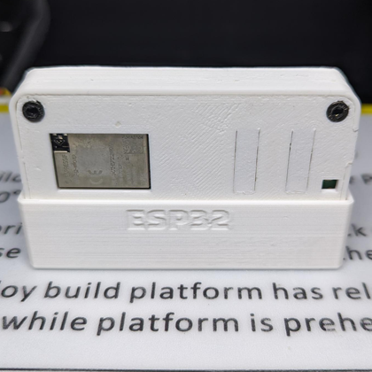
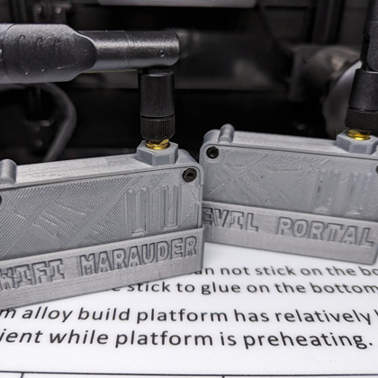
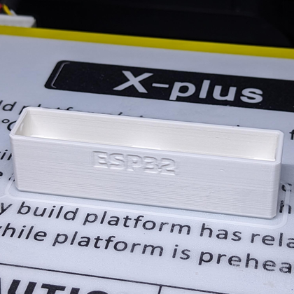

  
  <h2 align="center">Flipper Zero: Wi-Fi Dev Board Case Boot Cover</h2>

### Description

This boot cover is made to fit my Flipper Zero WiFi Dev Board case found at the following locations:

https://www.thingiverse.com/thing:6090184

https://github.com/CodyTolene/3D-Printing/tree/main/Flipper%20Zero%20-%20WiFi%20Dev%20Board%20Case

This is a remix of AWOK's [ESP32 V4 CASE][link-awok-case], which is quite beautiful. I highly recommend their products.

[ <a href="#top">Top</a> | <a href="../README.md">Index</a> ]

### File Downloads

- Boot Cover (3mf): [Download][download-3mf]

- Boot Cover (stl): [Download][download-stl] | [View][view-stl]

- Boot Cover w/ "ESP32" label (3mf): [Download][download-label-3mf]

- Boot Cover w/ "ESP32" label (stl): [Download][download-label-stl] | [View][view-label-stl]

[ <a href="#top">Top</a> | <a href="../README.md">Index</a> ]

### Images

[ <a href="#top">Top</a> | <a href="../README.md">Index</a> ]

<!-- LINKS -->

[download-3mf]: https://github.com/CodyTolene/3D-Printing/raw/main/Flipper%20Zero%20-%20WiFi%20Dev%20Board%20Case%20Boot%20Cover/Flipper_Zero_WiFi_Dev_Board_Case_Boot_Cover.3mf
[download-label-3mf]: https://github.com/CodyTolene/3D-Printing/raw/main/Flipper%20Zero%20-%20WiFi%20Dev%20Board%20Case%20Boot%20Cover/Flipper_Zero_WiFi_Dev_Board_Case_Boot_Cover_Label.3mf
[download-label-stl]: https://github.com/CodyTolene/3D-Printing/raw/main/Flipper%20Zero%20-%20WiFi%20Dev%20Board%20Case%20Boot%20Cover/Flipper_Zero_WiFi_Dev_Board_Case_Boot_Cover_Label.stl
[download-stl]: https://github.com/CodyTolene/3D-Printing/raw/main/Flipper%20Zero%20-%20WiFi%20Dev%20Board%20Case%20Boot%20Cover/Flipper_Zero_WiFi_Dev_Board_Case_Boot_Cover.stl
[link-awok-case]: https://www.thingiverse.com/thing:5961313
[view-label-stl]: https://github.com/CodyTolene/3D-Printing/blob/main/Flipper%20Zero%20-%20WiFi%20Dev%20Board%20Case%20Boot%20Cover/Flipper_Zero_WiFi_Dev_Board_Case_Boot_Cover_Label.stl
[view-stl]: https://github.com/CodyTolene/3D-Printing/blob/main/Flipper%20Zero%20-%20WiFi%20Dev%20Board%20Case%20Boot%20Cover/Flipper_Zero_WiFi_Dev_Board_Case_Boot_Cover.stl
