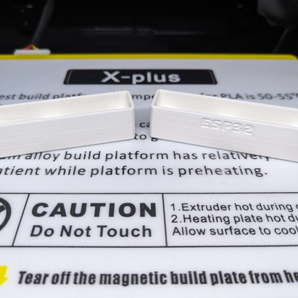

  
  <h2 align="center">Flipper Zero: Wi-Fi Dev Board Case Boot Cover</h2>

### Description

This pin boot cover is made to fit my Flipper Zero WiFi Dev Board case found at the following locations:

- https://www.printables.com/model/606858

- https://www.thingiverse.com/thing:6090184

- https://github.com/CodyTolene/3D-Printing/tree/main/Flipper%20Zero%20-%20WiFi%20Dev%20Board%20Case

- https://www.thingiverse.com/thing:5564906

This is a remix of AWOK's ESP32 V4 case cover (https://www.thingiverse.com/thing:5961313), which is quite beautiful. I highly recommend their products.

My print settings:

- Hatchbox PLA
- 0.2mm layer height
- 0.4mm nozzle (line width)
- Enable retraction
- Wall count 3 (+ print thin walls enabled)
- Top/bottom layers: 4
- Infill density: 20%
- Infill pattern: Cubic
- Print temp 200 C
- Bed temp 60 C
- No supports needed

Enjoy!

[ <a href="#top">Top</a> | <a href="../README.md">Index</a> ]

### File Downloads

- Boot Pin Cover, no labels: [3mf][download-3mf] | [stl][download-stl] | [view][view-stl]

- Boot Pin Cover w/ "ESP32" label: [3mf][download-esp32-3mf] | [stl][download-esp32-stl] | [view][view-esp32-stl]

- Boot Pin Cover w/ "Evil Portal" label: [3mf][download-evil-portal-3mf] | [stl][download-evil-portal-stl] | [view][view-evil-portal-stl]

- Boot Pin Cover w/ "WiFi Marauder" label: [3mf][download-marauder-3mf] | [stl][download-marauder-stl] | [view][view-marauder-stl]

[ <a href="#top">Top</a> | <a href="../README.md">Index</a> ]

### License

CC-BY-NC-4.0 ([view license][link-license])

[ <a href="#top">Top</a> | <a href="../README.md">Index</a> ]

### Images

---

---

---

---

[ <a href="#top">Top</a> | <a href="../README.md">Index</a> ]

<!-- LINKS -->

[link-awok-case]: https://www.thingiverse.com/thing:5961313
[link-license]: https://github.com/CodyTolene/3D-Printing/blob/main/Flipper%20Zero%20-%20WiFi%20Dev%20Board%20Case%20Boot%20Cover/LICENSE.md

<!-- DOWNLOADS: SET 1 -->

[download-3mf]: https://github.com/CodyTolene/3D-Printing/raw/main/Flipper%20Zero%20-%20WiFi%20Dev%20Board%20Case%20Boot%20Cover/Flipper_Zero_WiFi_Dev_Board_Case_Boot_Cover.3mf
[download-stl]: https://github.com/CodyTolene/3D-Printing/raw/main/Flipper%20Zero%20-%20WiFi%20Dev%20Board%20Case%20Boot%20Cover/Flipper_Zero_WiFi_Dev_Board_Case_Boot_Cover.stl
[view-stl]: https://github.com/CodyTolene/3D-Printing/blob/main/Flipper%20Zero%20-%20WiFi%20Dev%20Board%20Case%20Boot%20Cover/Flipper_Zero_WiFi_Dev_Board_Case_Boot_Cover.stl

<!-- DOWNLOADS: SET 2 -->

[download-esp32-3mf]: https://github.com/CodyTolene/3D-Printing/raw/main/Flipper%20Zero%20-%20WiFi%20Dev%20Board%20Case%20Boot%20Cover/Flipper_Zero_WiFi_Dev_Board_Case_Boot_Cover_esp32.3mf
[download-esp32-stl]: https://github.com/CodyTolene/3D-Printing/raw/main/Flipper%20Zero%20-%20WiFi%20Dev%20Board%20Case%20Boot%20Cover/Flipper_Zero_WiFi_Dev_Board_Case_Boot_Cover_esp32.stl
[view-esp32-stl]: https://github.com/CodyTolene/3D-Printing/blob/main/Flipper%20Zero%20-%20WiFi%20Dev%20Board%20Case%20Boot%20Cover/Flipper_Zero_WiFi_Dev_Board_Case_Boot_Cover_esp32.stl

<!-- DOWNLOADS: SET 3 -->

[download-evil-portal-3mf]: https://github.com/CodyTolene/3D-Printing/raw/main/Flipper%20Zero%20-%20WiFi%20Dev%20Board%20Case%20Boot%20Cover/Flipper_Zero_WiFi_Dev_Board_Case_Boot_Cover_Evil_Portal.3mf
[download-evil-portal-stl]: https://github.com/CodyTolene/3D-Printing/raw/main/Flipper%20Zero%20-%20WiFi%20Dev%20Board%20Case%20Boot%20Cover/Flipper_Zero_WiFi_Dev_Board_Case_Boot_Cover_Evil_Portal.stl
[view-evil-portal-stl]: https://github.com/CodyTolene/3D-Printing/blob/main/Flipper%20Zero%20-%20WiFi%20Dev%20Board%20Case%20Boot%20Cover/Flipper_Zero_WiFi_Dev_Board_Case_Boot_Cover_Evil_Portal.stl

<!-- DOWNLOADS: SET 4 -->

[download-marauder-3mf]: https://github.com/CodyTolene/3D-Printing/raw/main/Flipper%20Zero%20-%20WiFi%20Dev%20Board%20Case%20Boot%20Cover/Flipper_Zero_WiFi_Dev_Board_Case_Boot_Cover_Marauder.3mf
[download-marauder-stl]: https://github.com/CodyTolene/3D-Printing/raw/main/Flipper%20Zero%20-%20WiFi%20Dev%20Board%20Case%20Boot%20Cover/Flipper_Zero_WiFi_Dev_Board_Case_Boot_Cover_Marauder.stl
[view-marauder-stl]: https://github.com/CodyTolene/3D-Printing/blob/main/Flipper%20Zero%20-%20WiFi%20Dev%20Board%20Case%20Boot%20Cover/Flipper_Zero_WiFi_Dev_Board_Case_Boot_Cover_Marauder.stl
