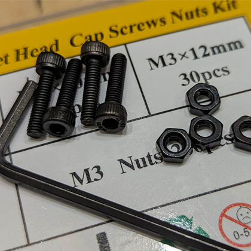

  
  <h2 align="center">Flipper Zero: Wi-Fi Dev Board Case (Basic)</h2>

### Description

Elevate your Flipper Zero experience with the exceptional Flipper Zero: Wi-Fi Dev Board Case (Basic). This print is specifically designed for the basic WiFi board straight out of the box, omitting features such as the antenna and SD card slot.

This creation is a remix of magdong's [Wi-Fi Dev Board Case][link-wifi-case] meticulously tailored to fit the unique specifications of the [Flipper Zero WiFi Devboard][link-flipper-zero-wifi-devboard].

For secure assembly, utilize 4 x M3x12mm screws accompanied by 4 x M3 nuts, boasting a sleek black oxide finish. To conveniently acquire these screws, follow this [Amazon Link][link-amazon-parts] (https://amzn.to/43Z3rvN).

[ <a href="#top">Top</a> | <a href="../README.md">Index</a> ]

### File Downloads

- Wi-Fi Dev Board Case Top (open front): [3mf][download-top-3mf] | [stl][download-top-stl] | [view][view-top-stl]

- Wi-Fi Dev Board Case Top (closed front): [3mf][download-top-closed-3mf] | [stl][download-top-closed-stl] | [view][view-top-closed-stl]

- Wi-Fi Dev Board Case Bottom: [3mf][download-bottom-3mf] | [stl][download-bottom-stl] | [view][view-bottom-stl]

[ <a href="#top">Top</a> | <a href="../README.md">Index</a> ]

### Images

---

---

---

---

---

---

---

---

---

---

---

[ <a href="#top">Top</a> | <a href="../README.md">Index</a> ]

<!-- LINKS -->

[download-bottom-3mf]: https://github.com/CodyTolene/3D-Printing/raw/main/Flipper%20Zero%20-%20WiFi%20Dev%20Board%20Case/Flipper_Zero_WiFi_Dev_Board_Case_Bottom.3mf
[download-bottom-stl]: https://github.com/CodyTolene/3D-Printing/raw/main/Flipper%20Zero%20-%20WiFi%20Dev%20Board%20Case/Flipper_Zero_WiFi_Dev_Board_Case_Bottom.stl
[download-top-3mf]: https://github.com/CodyTolene/3D-Printing/raw/main/Flipper%20Zero%20-%20WiFi%20Dev%20Board%20Case/Flipper_Zero_WiFi_Dev_Board_Case_Top.3mf
[download-top-closed-3mf]: https://github.com/CodyTolene/3D-Printing/raw/main/Flipper%20Zero%20-%20WiFi%20Dev%20Board%20Case/Flipper_Zero_WiFi_Dev_Board_Case_Top_Closed.3mf
[download-top-closed-stl]: https://github.com/CodyTolene/3D-Printing/raw/main/Flipper%20Zero%20-%20WiFi%20Dev%20Board%20Case/Flipper_Zero_WiFi_Dev_Board_Case_Top_Closed.stl
[download-top-stl]: https://github.com/CodyTolene/3D-Printing/raw/main/Flipper%20Zero%20-%20WiFi%20Dev%20Board%20Case/Flipper_Zero_WiFi_Dev_Board_Case_Top.stl
[link-amazon-parts]: https://amzn.to/43Z3rvN
[link-flipper-zero-wifi-devboard]: https://shop.flipperzero.one/products/wifi-devboard
[link-flipper-zero]: https://flipperzero.one/
[link-wifi-case]: https://www.thingiverse.com/thing:5564906
[view-bottom-stl]: https://github.com/CodyTolene/3D-Printing/blob/main/Flipper%20Zero%20-%20WiFi%20Dev%20Board%20Case/Flipper_Zero_WiFi_Dev_Board_Case_Bottom.stl
[view-top-closed-stl]: https://github.com/CodyTolene/3D-Printing/blob/main/Flipper%20Zero%20-%20WiFi%20Dev%20Board%20Case/Flipper_Zero_WiFi_Dev_Board_Case_Top_Closed.stl
[view-top-stl]: https://github.com/CodyTolene/3D-Printing/blob/main/Flipper%20Zero%20-%20WiFi%20Dev%20Board%20Case/Flipper_Zero_WiFi_Dev_Board_Case_Top.stl
