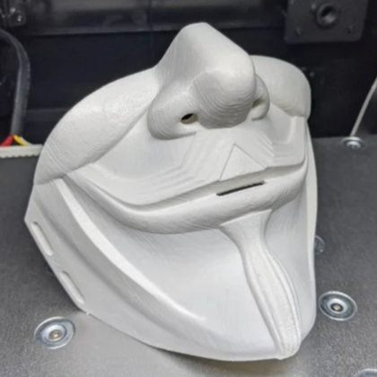
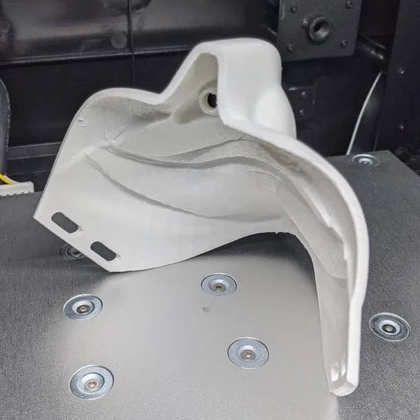
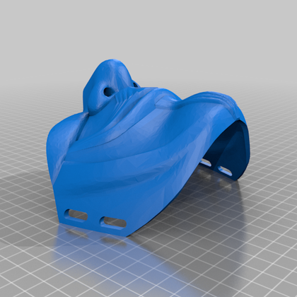
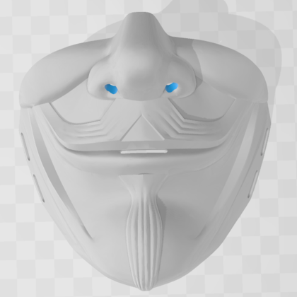
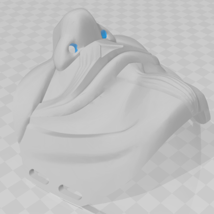

  
  <h2 align="center">Guy Fawkes Half Mask</h2>

### Description

Introducing the Guy Fawkes Half Mask.

For optimal print quality, it's recommended to use support structuring during the printing process. After thorough experimentation, tree support has been proven to be the most effective and resource-efficient choice.

Set your layer height to 0.16mm to ensure intricate details in your print. While the print time may take around 10 hours, the end result will be well worth the wait. The material cost for this mask is estimated at approximately 80g.

[ <a href="#top">Top</a> | <a href="../README.md">Index</a> ]

### File Downloads

- Guy Fawkes Half Mask: [3mf][download-3mf] | [stl][download-stl] | [view][view-stl]

[ <a href="#top">Top</a> | <a href="../README.md">Index</a> ]

### License

CC-BY-NC-4.0 ([view license][link-license])

[ <a href="#top">Top</a> | <a href="../README.md">Index</a> ]

### Images

---

---

---

---

---

---

[ <a href="#top">Top</a> | <a href="../README.md">Index</a> ]

<!-- LINKS -->

[link-license]: https://github.com/CodyTolene/3D-Printing/blob/main/Guy%20Fawkes%20Half%20Mask/LICENSE.md

<!-- DOWNLOADS: SET 1 -->

[download-3mf]: https://github.com/CodyTolene/3D-Printing/raw/main/Guy%20Fawkes%20Half%20Mask/Guy%20Fawkes%20Half%20Mask.3mf
[download-stl]: https://github.com/CodyTolene/3D-Printing/raw/main/Guy%20Fawkes%20Half%20Mask/Guy%20Fawkes%20Half%20Mask.stl
[view-stl]: https://github.com/CodyTolene/3D-Printing/blob/main/Guy%20Fawkes%20Half%20Mask/Guy%20Fawkes%20Half%20Mask.stl
