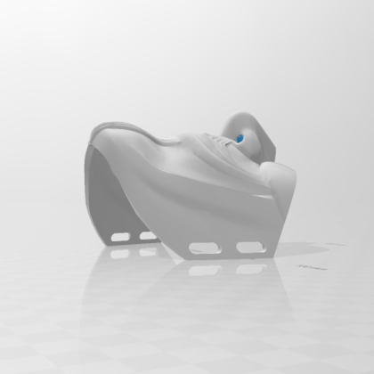

  
  <h2 align="center">Guy Fawkes Half Mask</h2>

### Description

Introducing the enigmatic Guy Fawkes Printable Half Mask, designed to ignite intrigue on Halloween night or during casual outings. This mask combines a mysterious allure with practicality, boasting excellent breathability and a snug fit that suits most face shapes.

For optimal print quality, it is recommended to use support structuring during the printing process. After thorough experimentation, tree support has been proven to be the most effective and resource-efficient choice.

Set your layer height to a precise 0.16mm to ensure intricate details in your print. While the print time may take around 10 hours, the end result will be well worth the wait. Keep in mind that the material cost for this mask is estimated at approximately 80g.

Unleash your inner enigma with the Guy Fawkes Printable Half Mask. Let it shroud your identity and evoke a sense of mystery as you venture into the night. Whether it's for Halloween revelry or adding an air of intrigue to your everyday attire, this mask is sure to captivate the imagination. Embrace the unknown and embrace the allure of this enigmatic accessory.

[ <a href="../README.md">Back to index</a> ]

---

### Images

[ <a href="../README.md">Back to index</a> ]

<!-- LINKS -->
