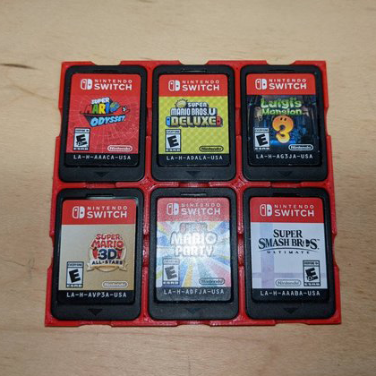

  
  <h2 align="center">Nintendo Switch Game Cartridge Panel (slim)</h2>

### Description

Introducing the sleek and practical alternative to the Nintendo Switch Game Cartridge Wall Mount Holder/Display Panel. This version is designed to be lightweight and efficient, perfect for your gaming needs. It can securely hold up to six Nintendo Switch Game Cartridges and is available in both wall mount and non-wall mount options.

With a quick print time of approximately 30 minutes, you'll have this handy accessory ready to use in no time. The cartridges fit snugly into the holder, providing a secure grip on the edges to keep them firmly in place. If you happen to have a high-quality printer, you may need to slightly reduce the size (less than 0.2%) to ensure a perfect fit with smoother side walls.

Cartridge pocket inner dimensions:
x = 21.5 mm
y = 31.25 mm
z = 3.5 mm

[ <a href="#top">Top</a> | <a href="../README.md">Index</a> ]

### File Downloads

- Switch Game Cartridge Panel (slim): [3mf][download-3mf] | [stl][download-stl] | [view][view-stl]

- Switch Game Cartridge Panel (slim, wall mountable): [3mf][download-wall-mount-3mf] | [stl][download-wall-mount-stl] | [view][view-wall-mount-stl]

For the thicker version of this print, see [here][link-switch-game-cartridge-panel].

[ <a href="#top">Top</a> | <a href="../README.md">Index</a> ]

### License

CC-BY-NC-4.0 ([view license][link-license])

[ <a href="#top">Top</a> | <a href="../README.md">Index</a> ]

### Images

---

---

[ <a href="#top">Top</a> | <a href="../README.md">Index</a> ]

<!-- LINKS -->

[link-license]: https://github.com/CodyTolene/3D-Printing/blob/main/Switch%20Game%20Cartridge%20Panel%20(slim)/LICENSE.md
[link-switch-game-cartridge-panel]: https://github.com/CodyTolene/3D-Printing/tree/main/Switch%20Game%20Cartridge%20Panel

<!-- DOWNLOADS: SET 1 -->

[download-3mf]: https://github.com/CodyTolene/3D-Printing/raw/main/Switch%20Game%20Cartridge%20Panel%20(slim)/Switch%20Game%20Cartridge%20Panel%20(slim).3mf
[download-stl]: https://github.com/CodyTolene/3D-Printing/raw/main/Switch%20Game%20Cartridge%20Panel%20(slim)/Switch%20Game%20Cartridge%20Panel%20(slim).stl
[view-stl]: https://github.com/CodyTolene/3D-Printing/blob/main/Switch%20Game%20Cartridge%20Panel%20(slim)/Switch%20Game%20Cartridge%20Panel%20(slim).stl

<!-- DOWNLOADS: SET 1 -->

[download-wall-mount-3mf]: https://github.com/CodyTolene/3D-Printing/raw/main/Switch%20Game%20Cartridge%20Panel%20(slim)/Switch%20Game%20Cartridge%20Panel%20(slim)%20Wall%20Mount.3mf
[download-wall-mount-stl]: https://github.com/CodyTolene/3D-Printing/raw/main/Switch%20Game%20Cartridge%20Panel%20(slim)/Switch%20Game%20Cartridge%20Panel%20(slim)%20Wall%20Mount.stl
[view-wall-mount-stl]: https://github.com/CodyTolene/3D-Printing/blob/main/Switch%20Game%20Cartridge%20Panel%20(slim)/Switch%20Game%20Cartridge%20Panel%20(slim)%20Wall%20Mount.stl
