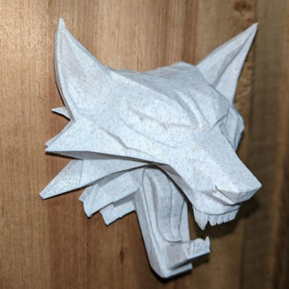
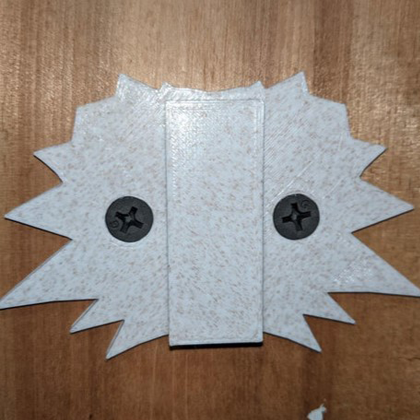

  
  <h2 align="center">Witcher Emblem Key Hook</h2>

### Description

Introducing the exquisite Witcher Emblem, forged with precision at Kaer Morhen. This mountable masterpiece boasts a dovetail slide wall mount back plate, allowing you to effortlessly attach and slide the medallion key hook into place. The meticulous design ensures a perfect fit, as the dovetail rail on the back plate is crafted slightly smaller than the back-inlet of the front piece. With a little cleaning, you'll experience seamless sliding without any hassle.

A remix of [Witcher towel hook/key holder][link-witcher-key-hook] by Vladeer.

[ <a href="#top">Top</a> | <a href="../README.md">Index</a> ]

### File Downloads

- Witcher Emblem Key Hook: [3mf][download-3mf] | [stl][download-stl] | [view][view-stl]

[ <a href="#top">Top</a> | <a href="../README.md">Index</a> ]

### License

CC-BY-NC-4.0 ([view license][link-license])

[ <a href="#top">Top</a> | <a href="../README.md">Index</a> ]

### Images

---

---

[ <a href="#top">Top</a> | <a href="../README.md">Index</a> ]

<!-- LINKS -->

[link-license]: https://github.com/CodyTolene/3D-Printing/blob/main/Witcher%20Emblem%20Key%20Hook/LICENSE.md
[link-witcher-key-hook]: https://www.thingiverse.com/thing:4835019

<!-- DOWNLOADS: SET 1 -->

[download-3mf]: https://github.com/CodyTolene/3D-Printing/raw/main/Witcher%20Emblem%20Key%20Hook/Witcher%20Emblem%20Key%20Hook.3mf
[download-stl]: https://github.com/CodyTolene/3D-Printing/raw/main/Witcher%20Emblem%20Key%20Hook/Witcher%20Emblem%20Key%20Hook.stl
[view-stl]: https://github.com/CodyTolene/3D-Printing/blob/main/Witcher%20Emblem%20Key%20Hook/Witcher%20Emblem%20Key%20Hook.stl
