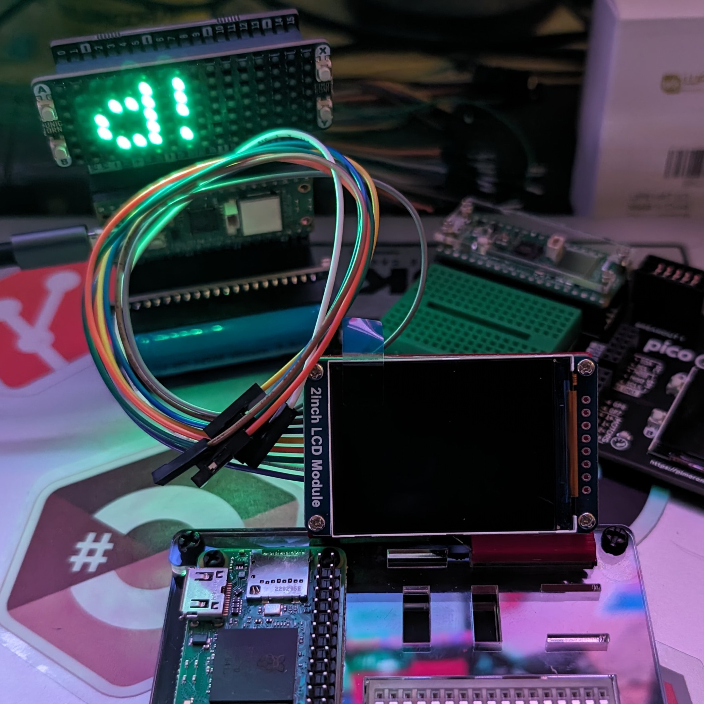
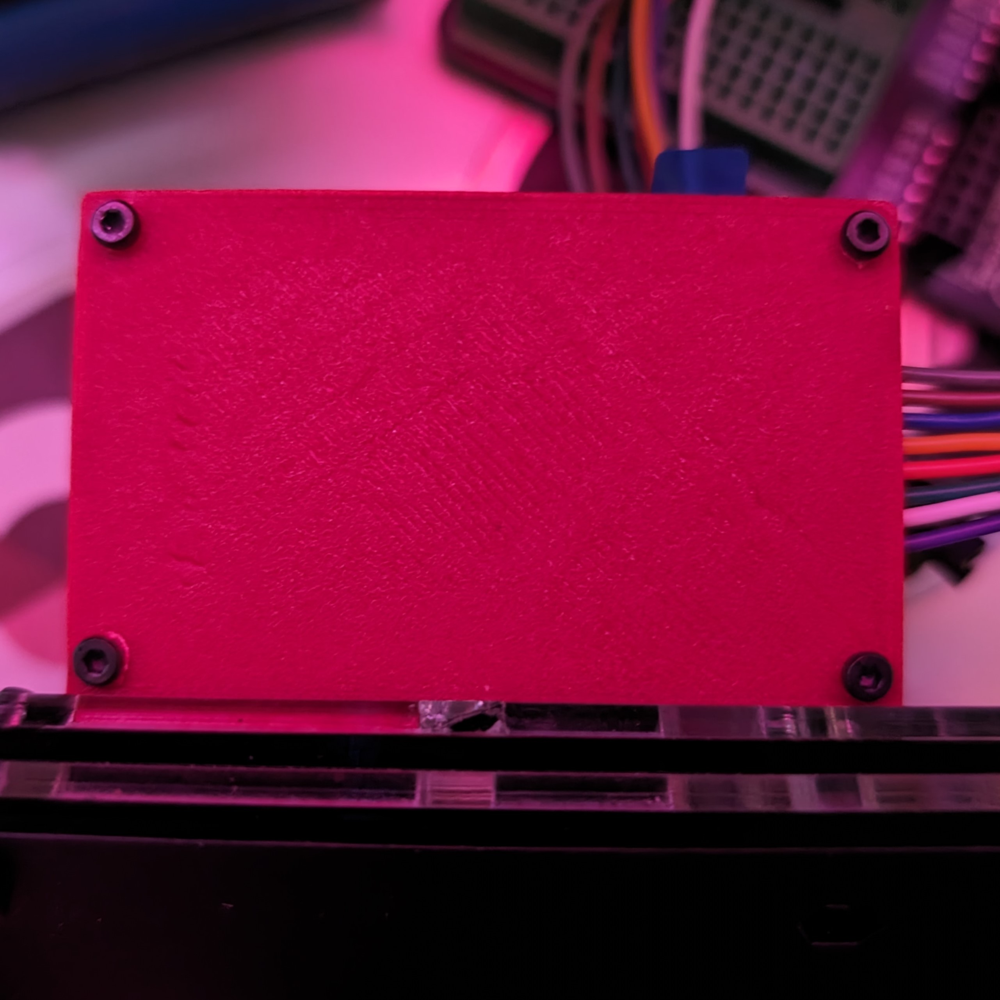
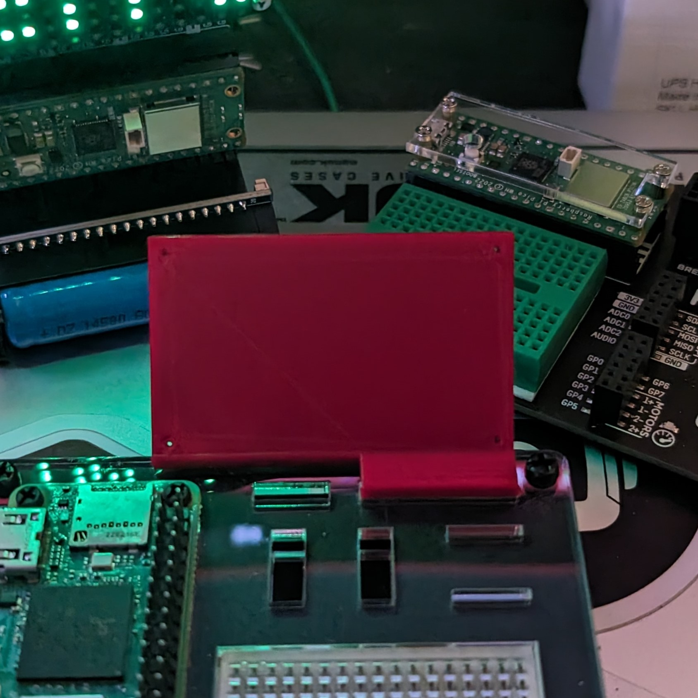
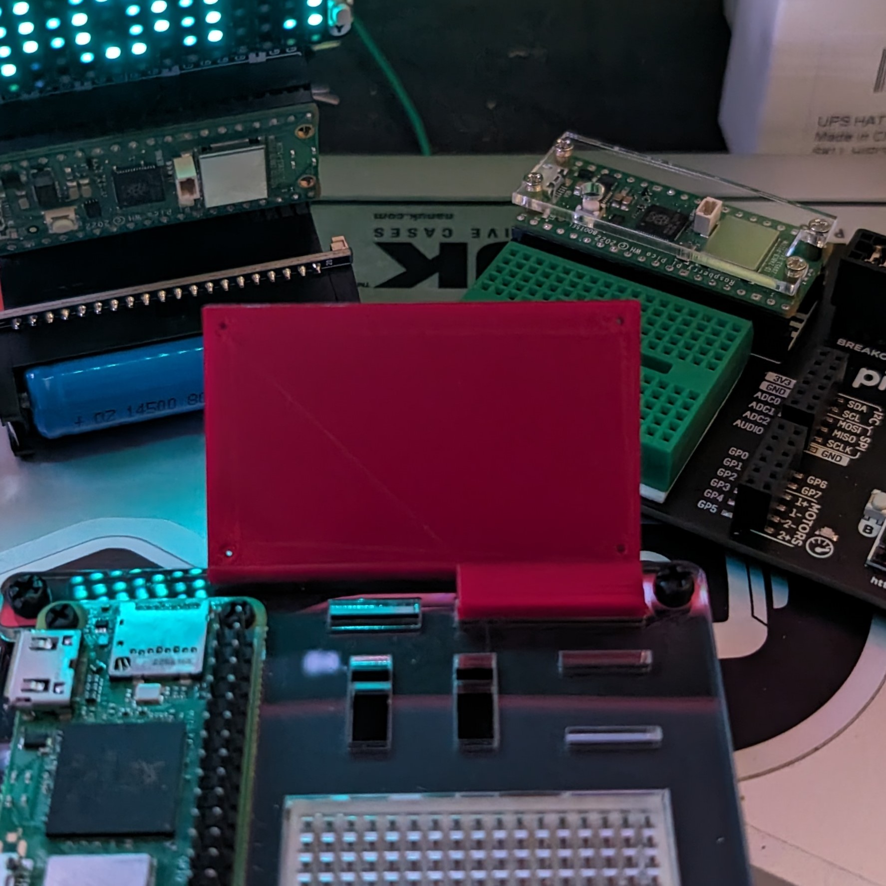
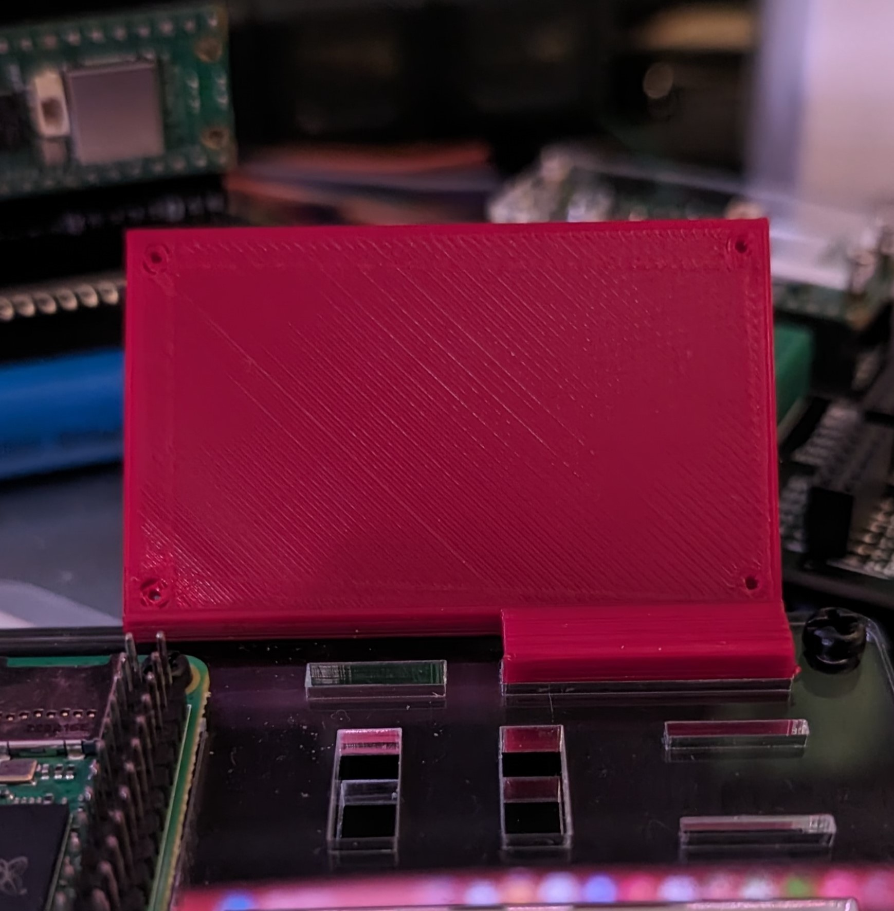
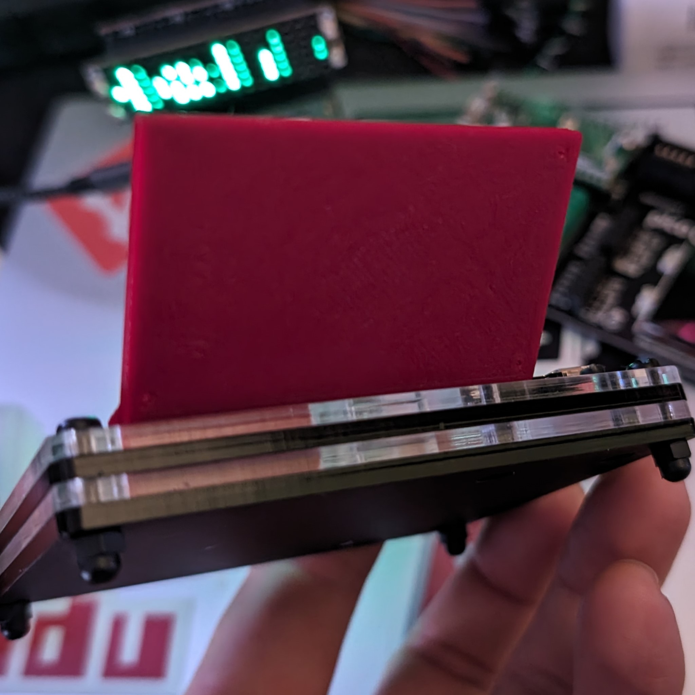
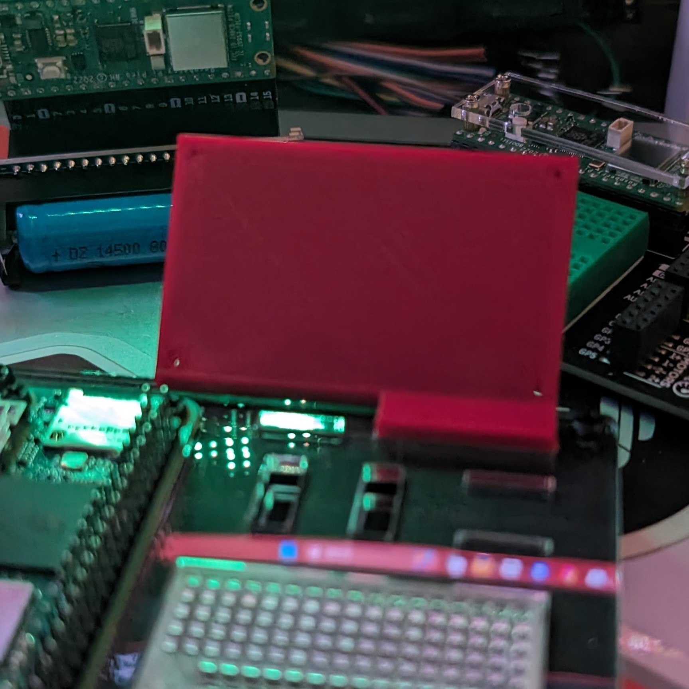

  
  <h2 align="center">ZeroDock Display Mount</h2>

### Description

A screen display mount for the ZeroDock Station. This mount is designed to hold a 2" screen display by default, but I've included the 3mf file so you can adjust the size to fit your needs. The mount is designed to slide into the ZeroDock station and hold the screen in place.

### Parts

ZeroDock Station: 

https://www.pishop.us/product/zerodock/

Raspberry Pi Zero 2 W:

https://www.pishop.us/product/raspberry-pi-zero-2-w-with-pre-soldered-headers/

Waveshare General 2inch IPS LCD Display Module (240×320): 

https://www.pishop.us/product/240-320-general-2inch-ips-lcd-display-module/

### Printing

All angles are 45 degrees to ensure a clean print without supports. The print takes around 45 minutes and uses approximately 7g of filament at 50% infill.

[ <a href="#top">Top</a> | <a href="../README.md">Index</a> ]

### File Downloads

- ZeroDock Display Mount: [3mf][download-3mf] | [stl][download-stl] | [view][view-stl]

[ <a href="#top">Top</a> | <a href="../README.md">Index</a> ]

### License

CC-BY-NC-4.0 ([view license][link-license])

[ <a href="#top">Top</a> | <a href="../README.md">Index</a> ]

### Images

  

  

  

  

  

  

  

  

[ <a href="#top">Top</a> | <a href="../README.md">Index</a> ]

<!-- LINKS -->

[link-license]: https://github.com/CodyTolene/3D-Printing/blob/main/ZeroDock%20Display%20Mount/LICENSE.md

<!-- DOWNLOADS -->

[download-3mf]: https://github.com/CodyTolene/3D-Printing/raw/main/ZeroDock%20Display%20Mount/ZeroDock-Display-Mount.3mf
[download-stl]: https://github.com/CodyTolene/3D-Printing/raw/main/ZeroDock%20Display%20Mount/ZeroDock-Display-Mount.stl
[view-stl]: https://github.com/CodyTolene/3D-Printing/blob/main/ZeroDock%20Display%20Mount/ZeroDock-Display-Mount.stl
